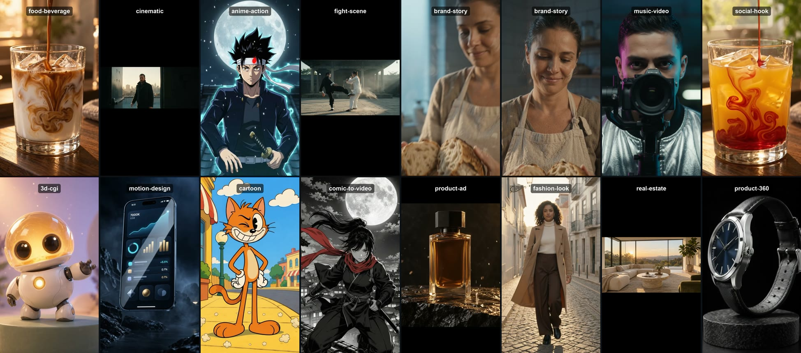
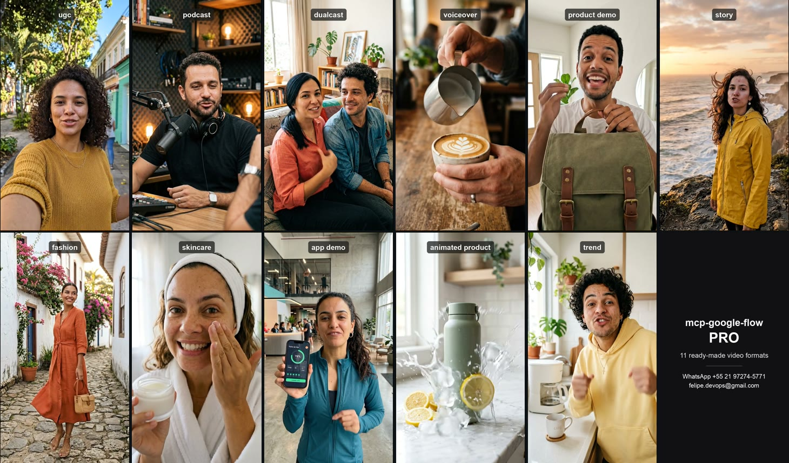

# mcp-google-flow

An MCP server that lets any MCP client produce videos and images in **Google Flow** (Veo, Nano Banana, Omni) through **your own signed-in Chrome**, with spending guards and a sandboxed file vault.

> [!WARNING]
> Independent project, **not affiliated with, endorsed or maintained by Google**. "Google Flow" and "Veo" are trademarks of Google.
> It automates Flow's web interface on your account. Automation may go against Google's Terms of Service and could lead to limits or suspension of the account. **Use it at your own risk**, ideally with an account separate from your main one. Flow changes its interface without notice; when it does, a tool may stop working until its labels are adjusted (see [When Flow's interface changes](#when-flows-interface-changes)).

## Showcase

[](https://youtube.com/shorts/yJ6sToM3Qn4)

**15 visual styles generated in Google Flow**: food, cinematic, anime, fight scene, brand story, music video, social hook, 3D, motion design, cartoon, comic, product ad, fashion, real estate and product 360. [▶ Watch the 62-second reel on YouTube](https://youtube.com/shorts/yJ6sToM3Qn4).

## What it does

- **Projects and media**: creates and opens projects, uploads images and videos, lists what is in the grid, waits for renders and downloads with predictable names.
- **Generation with Flow's real options**: reads the modes (Image, Video, Frames), models (Veo 3.1, Omni, Nano Banana…), aspect ratios, resolution, duration, variants and **the credit price** Flow itself shows, live.
- **References by name**, like typing `@name`: characters, voices, avatars, images and videos from the library.
- **Frames**: video that starts and/or ends on a chosen image.
- **Reusable characters**, created from Flow's presets or from a description.
- **Shot lists**: several shots with the same character, with the whole list checked against the budget before the first credit is spent.
- **Scenes**: builds the timeline, **extends** the video, **edits** a clip with a prompt and exports the whole scene as a single mp4.
- **Flow tools** (Grid Architect, Stringout Creator, Storyboard Studio, Video Resizer and community tools): opens any of them, reads their controls, fills and clicks them.
- **Upscale** to 1080p and 4K on download.
- **Shot planner**: turns a script into ready shot prompts, with the camera chosen by each shot's job, natural gestures, a voice and accent kept identical across clips, and single-take prompts.
- **Guided slash commands** for 9 base-image jobs, script writing and voice design.
- **Pro version** with ready-made video formats (see [Pro version](#pro-version)).

**Nothing spends credits without an approved quote.** Every paid action takes two calls: the first prepares everything, shows the price and returns a `quote_id`; only the second, with `confirm: true` and that id, spends.

## Requirements

- Node.js 20.11+
- Google Chrome
- A Google account with access to Flow

## Installation

```bash
git clone https://github.com/felipedamacenoteodoro/mcp-google-flow.git
cd mcp-google-flow
npm ci
npm run build
```

Register it in your MCP client as a stdio server. Most clients accept this configuration:

```json
{
  "mcpServers": {
    "flow-studio": {
      "command": "node",
      "args": ["/absolute/path/to/mcp-google-flow/dist/main.js"]
    }
  }
}
```

### First run

1. Ask the agent to *"call flow_sign_in"*. It opens a Chrome window with **the project's own profile**.
2. Sign in to Google **yourself** in that window. The server never sees or types your password.
3. Ask for *"flow_session_info"*: it should report `signedIn: true`.

The login is kept in the dedicated profile (`~/.flow-studio-mcp/chrome-profile`). Your everyday Chrome is never touched or copied.

## Tools

| Area | Tool | Spends? | What it does |
|---|---|---|---|
| Session | `flow_session_info` | no | Connection, sign-in state, current URL and credit budget. Never launches Chrome. |
| | `flow_sign_in` | no | Opens Flow in the dedicated profile so you can sign in. |
| | `flow_list_projects` | no | Lists projects, newest first. |
| | `flow_new_project` | no | Creates a project and turns off the "Agent" that rewrites prompts. |
| | `flow_open_project` | no | Opens a project (only `https://flow.google.com`). |
| | `flow_capture_screen` | no | Screenshot for debugging. |
| Grid | `flow_list_assets` | no | Project items: index, kind (video/image/scene), name, ready or not. |
| | `flow_upload` | no | Uploads an image or video from an allowed input folder. |
| | `flow_wait` | no | Waits until the project holds N finished items. |
| | `flow_download` | 1080p/4K only | Saves into the output folder. `standard` is free. |
| | `flow_add_to_scene` | no | Creates a scene from a video. |
| Generation | `flow_list_options` | no | Modes, models, ratios, resolution, duration, variants and current price. |
| | `flow_generate` | **yes** | Image, video or frames, with references and attachments. |
| | `flow_run_shot_list` | **yes** | A sequence of shots with shared settings. |
| Library | `flow_find_resources` | no | Finds characters, voices, avatars, images and videos by name. |
| | `flow_attach_resource` | no | Attaches a resource to the prompt box. |
| | `flow_character_presets` | no | Character presets and the image model in use. |
| | `flow_create_character` | **yes** | Creates a reusable character. |
| Scenes | `flow_scene_open` | no | Opens a scene and reports whether it can be extended. |
| | `flow_scene_extend` | **yes** | Extends the scene (Veo-generated clips only). |
| | `flow_scene_edit` | **yes** | Edits the clip with a prompt. |
| | `flow_scene_download` | no | Exports the whole scene as one mp4. |
| | `flow_scene_close` | no | Back to the grid. |
| Planning | `flow_directing_guide` | no | Layouts, camera moves by purpose, gestures, prompt rules and the review checklist. |
| | `flow_plan_shots` | no | Script → shots with line, framing, camera, prompt and attachments. |
| | `flow_image_prompt` | no | Base-image prompt: avatar, identity sheet, outfit, angle, product, app… |
| Tools | `flow_tool_list` | no | Your tools, Google templates or community tools. |
| | `flow_tool_open` | no | Opens a tool by name; reuses your copy when one exists. |
| | `flow_tool_controls` | no | Reads the open tool's controls and their values. |
| | `flow_tool_fill` | no | Fills a field. |
| | `flow_tool_click` | when it looks like generating | Clicks a control. Buttons such as "Generate" require a quote. |
| | `flow_tool_close` | no | Back to the grid. |

### How spending is approved

1. The agent calls, for example, `flow_generate` with `confirm: false`. Flow gets configured, the prompt is typed, and the reply carries the price Flow shows plus a `quote` with a `quoteId`.
2. You review it. If you approve, the agent calls again **with the same request**, `confirm: true` and `quote_id`.
3. The server refuses when there is no quote, the quote belongs to another request, more than 10 minutes have passed, it was already used, or the price went up. When Flow shows no price (upscale, extend, tools) a conservative estimate is charged, never zero.

### Example conversation

> Create a project, upload `~/FlowStudio/input/barista.png`, make a character from it and generate three 9:16 shots of her presenting the new seasonal coffee. Show me the price first.

The agent calls `flow_new_project` → `flow_upload` → `flow_create_character` (quote → confirm) → `flow_run_shot_list` with `attach_resources` (quote → you approve → confirm) → `flow_wait` → `flow_download`.

## Guided commands

The server ships step-by-step flows that clients supporting MCP prompts show as slash commands, e.g. `/mcp__flow-studio__image_avatar`.

**Image** (the base image is what keeps the face identical in every clip)

| Command | What it does |
|---|---|
| `image_avatar` | Creates a realistic person to be the base of the videos |
| `image_identity_sheet` | Nine views of the same face, to keep the character consistent |
| `image_outfit_background` | Changes outfit or background, keeping the person |
| `image_look` | Changes one detail of the appearance (hair, glasses, age) |
| `image_angle` | The same scene from another camera angle |
| `image_product_in_hand` | The person holds the product, label untouched |
| `image_app_screen` | A real app screenshot on the phone, in two steps |
| `image_before_after` | Before and after of the same person |
| `image_swap_person` | A different person in the same pose, place and light |

**Support**

| Command | What it does |
|---|---|
| `script_write` | Writes a short script, one sentence per shot |
| `voice_design` | Builds a voice description to repeat in every clip |

The agent leads the conversation one question at a time, shows the quote, generates only after your "yes" and tells you the library name of the result so it can be reused as a reference. `flow_image_prompt` can also be called directly; it does not touch Flow and spends nothing.

## Shot planner

`flow_plan_shots` turns a script into one shot per spoken sentence and writes each prompt in a fixed order: scene → camera → gesture → line → voice → accent → "one continuous take, no cuts". You pick a **layout**:

| Layout | On screen |
|---|---|
| `solo` | One person talking to the lens |
| `two-in-frame` | Both people in every shot; one talks, the other listens with their mouth closed |
| `alternating` | Each shot shows only whoever is speaking, looking toward the other person |
| `narration` | Nobody talks on camera; shots illustrate a narration |

What it takes care of:

- **One spoken sentence per shot.** Several sentences in one clip lead to cuts mid-speech.
- **The camera follows the shot's job:** hook, argument, key line or call to action, e.g. locked on the key line, slow zoom on the face at the close. Framings and camera moves can be overridden per role (see `flow_directing_guide`).
- **Voice and visual description repeated word for word** in every clip of the same person; the plan warns when a voice is missing.
- **Two people in frame:** the speaker is named by side (left/right) and only they get a voice. All clips can be animated from one base image with both people (frames mode).
- **Long scripts:** the plan warns that lip-sync degrades and suggests narration.

Script markers:

```text
Leo: I never know which coffee to order.
Ana: [smiles] * Start with the seasonal blend. [nods]
```

`Name:` sets the speaker, `[gesture]` at the start or end of a line adds a gesture (at most one on each side, written in English), and `*` marks the key line. Spoken lines can be in any language. Each person's voice goes in the cast, as text or as `{gender, age, pitch, texture, delivery}`.

## Pro version

The reel above shows what Google Flow can produce. The Pro version gets you there faster: it adds **ready-made video formats** on top of this server, each with its own guided slash command: selfie testimonial (UGC), podcast, dualcast, voiceover, product demo, skincare, app demo, fashion, animated product, trend and story. Every format brings its casting, framings, camera plan, rules and the questions to ask, so a complete video comes out of a single conversation.

[](https://youtube.com/shorts/4D-1cMaVD3Y)

**All 11 Pro formats, generated in Google Flow** with the Pro guided commands. [▶ Watch the 44-second reel on YouTube](https://youtube.com/shorts/4D-1cMaVD3Y).

Interested? Get in touch:

- Email: **felipe.devops@gmail.com**
- WhatsApp: **[+55 21 97274-5771](https://wa.me/5521972745771)**

## Configuration

Everything is set through environment variables, validated at startup:

| Variable | Default | Purpose |
|---|---|---|
| `FLOW_MCP_INPUT_DIRS` | `~/FlowStudio/input` | Folders uploads are accepted from (separate with `:`, or `;` on Windows). |
| `FLOW_MCP_OUTPUT_DIR` | `~/FlowStudio/output` | Where downloads are saved. |
| `FLOW_MCP_MAX_CREDITS` | `100` | Credit budget per server session. |
| `FLOW_MCP_FALLBACK_CREDITS` | `20` | Estimate per variant when Flow shows no price. |
| `FLOW_MCP_PAID_PER_HOUR` | `20` | Cap on paid actions per hour. |
| `FLOW_MCP_MAX_IMAGE_MB` / `FLOW_MCP_MAX_VIDEO_MB` | `20` / `500` | Maximum upload size. |
| `FLOW_MCP_HOME` | `~/.flow-studio-mcp` | Dedicated Chrome profile. |
| `FLOW_MCP_CHROME_PATH` | auto-detected | Path to Chrome. |
| `FLOW_MCP_CDP_URL` | — | Connect to an already running Chrome (loopback only). |
| `FLOW_MCP_UI_LABELS` | — | JSON with interface labels (see below). |

## Security

What the server guarantees, in short (details in [SECURITY.md](SECURITY.md)):

- **Dedicated profile**: never uses or copies your personal Chrome profile.
- **DevTools on loopback only, random port**: Chrome picks the port. Endpoints outside `127.0.0.1`/`localhost` are refused.
- **Navigation restricted** to `https://flow.google.com`.
- **File vault**: uploads only from allowed folders, with the real path resolved (symlinks cannot escape), content checked by its leading bytes rather than its extension, and a size limit. Downloads only into the output folder, always as a new file (never overwrites, never follows a planted symlink).
- **Spending**: single-use quote bound to the exact request and price, a credit budget per session, an hourly limit, and attachments re-checked right before the click.
- **No code built from user text**: prompts are typed as keystrokes; values reach the browser as arguments, never as script source.
- **Logs on stderr only**, with emails, tokens and cookies masked. Internal errors never leak stack traces or paths to the agent.
- Tools run one at a time (there is a single tab), so concurrent calls cannot interleave.

## When Flow's interface changes

Every piece of interface text the server depends on lives in [`src/infrastructure/flow/ui-labels.ts`](src/infrastructure/flow/ui-labels.ts). If Flow changes a label, or your interface is in another language, create a JSON file with only what changed and point `FLOW_MCP_UI_LABELS` to it:

```json
{ "submit": "Generate", "tileMenu": "More options" }
```

Unknown keys are rejected, so a typo never passes silently. See [`ui-labels.example.json`](ui-labels.example.json).

The default labels were checked against the Portuguese interface on 2026-09-29: modes, models, ratios, price, library, characters, scenes, extend, download and tools. Not yet validated: the English interface, the 1080p/4K entries of the download menu, and the clear-prompt button (there is a fallback path).

## Architecture

```
src/
├── domain/           pure rules: prompt, settings, credits, shot planner, directing craft, image jobs, scenes, tools
├── application/      use cases, ports (one interface per area of Flow) and the spend guard
├── infrastructure/   adapters: Chrome/CDP, one class per area of Flow, file vault, logger, config
├── interface/mcp/    tool schemas and registration, guided commands
└── main.ts           composition root: the only place that instantiates concrete classes
```

Dependencies always point inward: the domain imports nothing, the application imports only the domain, and the infrastructure implements the ports. That is why the use cases are tested against a fake Flow, with no browser.

```bash
npm test          # domain, use cases and security guards
npm run typecheck
```

## License

MIT © Felipe D. Teodoro
